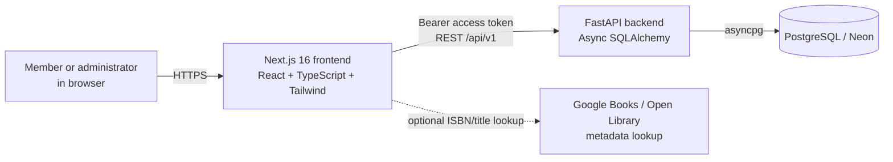
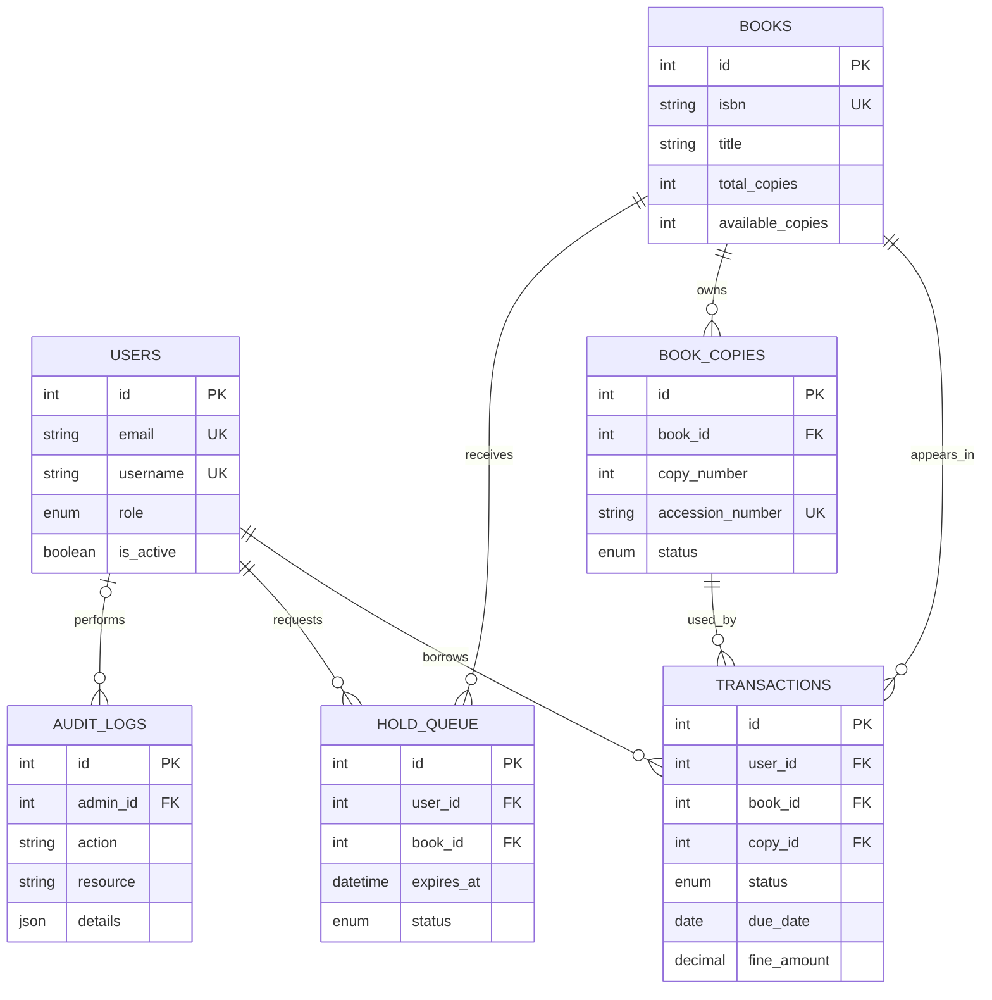
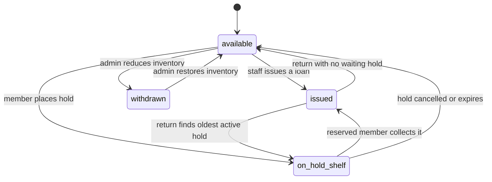
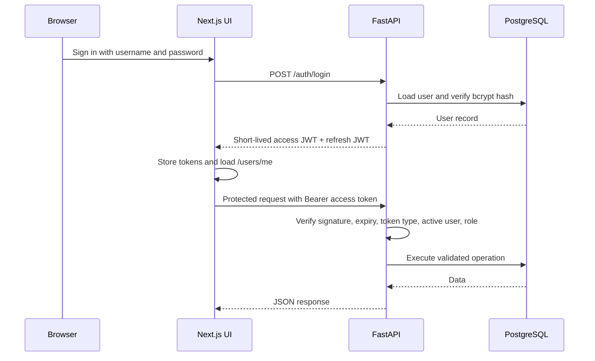

# Library Management System: Architecture and Interview Guide

> **Review date:** 4 October 2026  
> **Source of truth:** the current application source in this repository. The older root-level `README.md`, `SETUP_GUIDE.md`, and report describe earlier technology choices and should not be treated as the current architecture.

## 1. System in one minute

This is a role-based library circulation system built as a Next.js web application and a FastAPI API backed by PostgreSQL. Members can discover books, borrow them through staff, renew a loan, reserve one available copy, view return receipts, and manage alert preferences. Administrators manage catalogue records, physical copies, members, holds, issues, returns, fines, and analytics.

The key design choice is that a **book title** and a **physical book copy** are different things. A title such as *Clean Code* is represented once in `books`; each scannable or lendable item is represented in `book_copies`. Loans and hold-shelf reservations attach to a particular copy. This prevents two users from receiving the same copy during concurrent circulation operations.

### Current delivery status

| Area | Status in the reviewed source |
| --- | --- |
| Catalogue metadata, inventory counts, physical copies | Released |
| Holds, hold shelf expiry, renewals, return receipts | Released |
| Admin/member dashboards and analytics | Released |
| Alert preference page and API | Present in the working tree; not yet committed or deployed |
| Email, SMS, or push delivery | Not implemented; only preference storage exists |

## 2. High-level architecture



### Deployed topology

| Layer | Technology | Responsibility |
| --- | --- | --- |
| Web client | Next.js 16, React 19, TypeScript, Tailwind CSS | Pages, forms, role-aware navigation, local UI state, API calls |
| Frontend hosting | Vercel | Serves the Next.js application and applies response security headers |
| API | FastAPI, Pydantic, SQLAlchemy async | Authentication, authorization, validation, circulation rules, reporting endpoints |
| API hosting | Render | Runs the FastAPI service and the in-process hold-expiry loop |
| Database | PostgreSQL, provisioned through Neon | Durable users, catalogue, copies, transactions, holds, and audit events |
| External enrichment | Google Books and Open Library | Optional browser-side metadata lookup for catalogue entry and missing book details |

The frontend and API are independently deployable. The browser communicates with the API using `NEXT_PUBLIC_API_URL`; the API allows configured origins through CORS.

## 3. Component responsibilities

| Component | Important files | What it owns |
| --- | --- | --- |
| Application composition | `backend/app/main.py` | Router registration, CORS, `/api/health`, API docs, application lifespan |
| Configuration | `backend/app/core/config.py` | Database URL, JWT configuration, token lifetimes, environment, CORS origins |
| Database access | `backend/app/db/database.py` | Async PostgreSQL engine, session lifecycle, commit/rollback behavior |
| Security | `backend/app/core/security.py`, `dependencies.py` | bcrypt password hashing, signed JWTs, current-user and admin dependencies |
| Catalogue | `backend/app/api/v1/books.py`, `core/copies.py` | Books, metadata, stock adjustment, physical-copy creation and selection |
| Circulation | `backend/app/api/v1/transactions.py` | Issue, return, fine calculation, renewal, receipts |
| Holds | `backend/app/api/v1/holds.py`, `core/holds.py` | Reservation queue, shelf reservation, cancellation, 12-hour expiry |
| Identity | `backend/app/api/v1/auth.py`, `users.py` | Signup, login, token refresh, profile, member administration |
| Reporting | `dashboard.py`, `analytics.py` | Dashboard figures, recommendations, activity, reporting series |
| Frontend transport | `frontend/lib/api.ts` | Axios client, bearer-token attachment, one refresh retry after a 401 |
| Frontend identity | `frontend/context/AuthContext.tsx` | Session rehydration, sign-in, sign-out, role check |
| Frontend data cache | `frontend/app/providers.tsx` | React Query cache with a 60-second stale time |

## 4. Data model and low-level architecture

### Entity relationship diagram



`transactions.copy_id` is nullable for legacy history, although new issue and hold-shelf transactions use a physical copy.

### Tables, constraints, and meaning

| Table | Main fields | Constraints and purpose |
| --- | --- | --- |
| `users` | `name`, `email`, `username`, `hashed_password`, `role`, `is_active`, timestamps | Email and username are unique. `role` is `admin` or `member`. The current working tree adds `notify_due`, `notify_overdue`, and `notify_holds`, defaulting to true. |
| `books` | `title`, `author`, `isbn`, publishing and discovery metadata, `total_copies`, `available_copies` | ISBN is unique. The count fields are fast aggregate inventory values; individual copies remain the operational source for circulation. |
| `book_copies` | `book_id`, `copy_number`, `accession_number`, `status` | `(book_id, copy_number)` and `accession_number` are unique. Accession values follow `B{book_id}-{copy_number}`. |
| `transactions` | `user_id`, `book_id`, `copy_id`, issue/due/return dates, status, fine | Records loans and temporary hold-shelf reservations. It supports historic reporting and receipts. |
| `hold_queue` | `user_id`, `book_id`, request/expiry time, status | Records a member's reservation. Active/suspended is limited by application logic to one hold per member across the library. |
| `audit_logs` | `admin_id`, action, resource, resource id, JSON details, IP, timestamp | Captures circulation actions and the structured return-receipt details. |

### Status models

| Model | States | Operational meaning |
| --- | --- | --- |
| `BookCopy.status` | `available`, `issued`, `on_hold_shelf`, `withdrawn` | Determines whether a concrete copy can be issued. |
| `Transaction.status` | `requested`, `on_hold_shelf`, `in_transit`, `issued`, `returned`, `overdue`, `lost` | Current flows mainly create `issued`, `on_hold_shelf`, and `returned`; other values leave room for future workflows. |
| `HoldQueue.status` | `active`, `suspended`, `fulfilled`, `cancelled`, `expired` | Controls the reservation lifecycle. |

### Inventory invariants

These are the rules an interviewer should hear clearly:

1. A copy is issued only when its `BookCopy.status` is `available`.
2. A hold removes a copy from available stock immediately and places that exact copy on the hold shelf.
3. An issue or hold decrements `Book.available_copies`; a normal return, cancellation, or expiry restores it.
4. A return with a waiting hold moves the returned copy directly to `on_hold_shelf` rather than exposing it as available stock.
5. Writes that select a copy or book use database row locking (`SELECT ... FOR UPDATE`) to reduce double-issue and double-reserve races.

### Physical copy state machine



## 5. API design

All application endpoints are under `/api/v1`. The interactive API contract is available from the backend at `/api/docs` when the service is running.

| Area | Key endpoints | Access |
| --- | --- | --- |
| Authentication | `POST /auth/signup`, `POST /auth/login`, `POST /auth/refresh` | Public |
| Current user | `GET /users/me` | Authenticated |
| Alert preferences | `GET/PATCH /users/me/notification-preferences` | Authenticated; current working-tree feature |
| Member administration | `GET/POST /users/`, `PUT/DELETE /users/{id}`, `PATCH /users/{id}/toggle-active` | Admin |
| Catalogue | `GET /books/`, `GET /books/{id}` | Authenticated |
| Catalogue administration | `POST /books/`, `PATCH/DELETE /books/{id}`, `GET /books/{id}/copies` | Admin |
| Loans | `GET /transactions/`, `POST /transactions/issue`, `POST /transactions/{id}/return` | List is role-filtered; issue/return are admin |
| Loan self-service | `POST /transactions/{id}/renew`, `GET /transactions/{id}/receipt` | Borrower or admin, with ownership checks |
| Holds | `POST /holds/{book_id}`, `GET /holds/my-holds`, status changes and cancellation | Authenticated with ownership checks |
| Hold desk | `GET /holds/all` | Admin |
| Dashboard | `GET /dashboard/statistics`, `/recent-activity`, `/recommendations` | Authenticated; UI reserves administrative summaries for admins |
| Analytics | `GET /analytics/...` | Authenticated at API level; frontend exposes it to admins |

### Request path and authorization



The Axios response interceptor makes one refresh attempt after a 401 response. If refresh fails, it clears browser storage and sends the user to the login page.

## 6. Core user flows

### 6.1 Member discovery and hold

1. The member signs in and loads the books page.
2. The frontend requests paginated catalogue data with search, category, language, and available-only filters.
3. The member opens a book, sees inventory and metadata, then chooses **Place Hold**.
4. The backend expires stale reservations first, locks the member and book, confirms the member has no other active or suspended hold, and locks an available physical copy.
5. It creates a `hold_queue` record, creates a matching `on_hold_shelf` transaction, marks the copy `on_hold_shelf`, and decreases the book's available count.
6. The member sees the reservation on the dashboard or My Holds screen. It lasts 12 hours unless it is collected, cancelled, or expired.

### 6.2 Staff issue and return

```mermaid
sequenceDiagram
    participant M as Member
    participant S as Staff
    participant API as FastAPI
    participant DB as PostgreSQL

    M->>S: Requests a book or collects a hold
    S->>API: POST /transactions/issue
    API->>DB: Lock book and applicable copy
    alt Member owns an on-shelf hold
        API->>DB: Convert shelf transaction to issued; fulfil hold
    else Standard issue
        API->>DB: Select next available copy; create issued transaction
    end
    API-->>S: Loan confirmation

    M->>S: Returns copy
    S->>API: POST /transactions/{id}/return
    API->>DB: Lock transaction, book, copy; calculate fine
    alt Another active hold exists
        API->>DB: Assign returned copy to oldest hold shelf reservation
    else No waiting hold
        API->>DB: Mark copy available; increment available count
    end
    API->>DB: Store return audit details
    API-->>S: Receipt data
```

### 6.3 Renewal

1. The borrower opens My Loans and selects **Renew**.
2. The API confirms ownership and an active loan.
3. It allows only one renewal, extends the due date by seven days, and writes an audit event.
4. Renewal is blocked if another member has an active or suspended hold for the same title.

### 6.4 Fine and receipt

The API calculates a fine when staff returns an overdue loan:

| Overdue duration | Rate |
| --- | --- |
| On or before due date | ₹0 |
| Days 1 through 15 | ₹5 per day |
| Day 16 onward | ₹75 plus ₹50 for every day after day 15 |

The returned transaction stores the final `fine_amount`. The audit log stores receipt fields including assessed fine, waived amount, waiver reason, returned time, and receiving staff member. The system records the charge and waiver decision; it does not yet record a separate payment transaction.

### 6.5 Administrator workflow

1. Create or edit a catalogue title, including ISBN, shelf, category, language, publisher, edition, and copy count.
2. The backend creates or withdraws physical-copy rows while preserving issued copies.
3. Search or manage member accounts, activate/deactivate accounts, and prevent deletion of a member with an issued loan.
4. Issue, return, inspect reservations, and view receipt history.
5. Review dashboard stock warnings, activity, rankings, and analytics.

## 7. Frontend architecture

### Page map

| Route | Main audience | Purpose |
| --- | --- | --- |
| `/login`, `/signup` | Public | Account access and member registration |
| `/dashboard` | All authenticated users | Role-adaptive home dashboard |
| `/dashboard/books` | All authenticated users | Search, filter, browse, reserve; administrators also edit and issue |
| `/dashboard/books/add`, `/dashboard/books/[id]/edit` | Admin | Catalogue and physical-inventory management |
| `/dashboard/transactions` | All authenticated users | Member loan history or staff circulation desk |
| `/dashboard/holds` | Admin | Hold desk and reservation view |
| `/dashboard/members` | Admin | Member search, creation, editing, activation, deletion |
| `/dashboard/analytics` | Admin in the UI | Charts and reporting |
| `/dashboard/profile` | All authenticated users | Alert preferences; currently not released |

### UI data strategy

React Query fetches and caches server data. Mutation screens explicitly refetch relevant queries after successful actions. The UI uses toast feedback and confirmation dialogs for destructive member/circulation actions. Theme preference and authentication tokens are stored in browser local storage.

The catalog page can enrich a missing book description in the browser from Google Books or Open Library. This is convenience metadata, not a dependency of the core circulation path.

## 8. Security, correctness, and operational design

### What is in place

- Passwords are hashed and verified with bcrypt; raw passwords are not persisted.
- Access and refresh JWTs have distinct token types and expiration periods: 15 minutes and 7 days by default.
- Protected API dependencies validate token type, signature, user existence, active status, and admin role where required.
- Unique constraints protect email, username, ISBN, copy numbering, and accession numbering.
- Copy and book selection uses row locks for issue, hold, return, and hold expiry operations.
- The frontend sends `X-Frame-Options: DENY`, `X-Content-Type-Options: nosniff`, a strict referrer policy, and HSTS through `next.config.ts`.
- CORS is configured from environment rather than hard-coded only in application code.

### Important limits to discuss honestly

| Topic | Current behavior | Improvement |
| --- | --- | --- |
| Browser token storage | JWTs are in `localStorage`, which is vulnerable to token theft if an XSS issue occurs | Use secure, HttpOnly, SameSite cookies with CSRF protection |
| JWT revocation | Refresh tokens are stateless; logout clears browser state only | Store token/session identifiers and support rotation and revocation |
| Secret defaults | `SECRET_KEY` has a development fallback | Require a non-default production secret at startup |
| Database migrations | `migrate_phase1.py` performs direct DDL and backfill work | Add versioned Alembic migrations with CI validation and rollback plans |
| Scheduled expiry | Every API process starts a 60-second expiry loop | Move it to a single scheduled worker/cron job when scaling to multiple replicas |
| Analytics access | API analytics endpoints require authentication but do not enforce admin at the API layer | Apply the admin dependency on analytics routes |
| Soft deletion | Book and member deletion are permanent in the current design | Use archival flags and retain immutable history |
| Notifications | Preferences are stored in the current working tree, but no messages are sent | Add an asynchronous notification worker and delivery audit |
| Payments | Fine amount is recorded, with waiver data in audit logs | Model payment, method, receipt, refund, and outstanding balance separately |
| Audit coverage | Core circulation actions are audited | Audit account, configuration, and inventory changes consistently |

### Availability and concurrency note

`Book.available_copies` makes stock reads quick, while `BookCopy` provides the authoritative individual item chosen for a loan. Any system that keeps both an aggregate and detail rows must protect their consistency. Here, the write paths update them in the same database transaction and lock affected rows. A future improvement is a periodic reconciliation job that detects and repairs aggregate drift, while alerting operators instead of silently hiding it.

## 9. Development, migration, and verification

### Local setup

Backend environment variables needed in `backend/.env`:

```dotenv
DATABASE_URL=postgresql://...
SECRET_KEY=a-long-random-production-secret
CORS_ORIGINS=["http://localhost:3000"]
ENVIRONMENT=development
```

```bash
cd backend
python -m venv venv
source venv/bin/activate
pip install -r requirements.txt
uvicorn app.main:app --reload --port 8000
```

```bash
cd frontend
npm install
NEXT_PUBLIC_API_URL=http://localhost:8000/api/v1 npm run dev
```

### Migration and test commands

```bash
cd backend
venv/bin/python migrate_phase1.py
pip install -r requirements-test.txt
venv/bin/python -m unittest discover -p 'test_*.py' -v
```

`migrate_phase1.py` creates missing inventory structures, adds relevant columns and indexes, backfills physical copies for older titles, and normalizes available-count values. It is useful for the project’s current phase but is not a replacement for a migration history.

### Existing verification coverage

The backend suite covers hold expiry, hold return behavior, hold workflow, renewal rules, return receipts, inventory adjustments, and physical-copy behavior. The current working tree also includes a notification-preference test. At the last local verification, 13 backend tests passed, TypeScript checking passed, and the production frontend build completed.

The next high-value tests are end-to-end browser journeys, concurrent issue/hold integration tests against PostgreSQL, token refresh/logout tests, and migration-upgrade tests. A full lint cleanup is also needed; the existing frontend code contains legacy lint findings even though type checking and builds pass.

## 10. Interview preparation

### A concise project introduction

> I built a role-based library management system with a Next.js frontend, a FastAPI backend, and PostgreSQL. The design separates titles from physical copies, so every issue, return, and reservation is tied to a real copy. The backend uses asynchronous database access, JWT authorization, row locking for circulation actions, a hold shelf with expiry, fine receipts, and audit records. I deployed the frontend and API independently and built dashboards for members and staff.

### Architecture explanation to use in an interview

> I chose a separated web client and API because the UI has a rich, responsive workflow while the business rules need a clear server boundary. Next.js handles the interaction layer and FastAPI owns validation, authorization, and transactional circulation rules. PostgreSQL holds the relational data. The most important domain choice is the `Book` versus `BookCopy` model: a title carries metadata and aggregate stock, while a copy is the unit that can be issued or held. That keeps inventory accurate as the library grows beyond one copy per title.

### Likely interview questions and strong, truthful answers

| Question | Answer outline |
| --- | --- |
| Why use physical copies instead of only a stock count? | A stock count cannot identify the item currently with a member or on a hold shelf. `BookCopy` gives each item an accession number and status while `Book.available_copies` keeps search and dashboard reads fast. |
| How do you prevent double issuing? | The server chooses an available copy inside a database transaction and locks the selected book/copy rows with `FOR UPDATE`. It changes the copy state and aggregate count before commit. |
| How do reservations work? | A hold immediately takes one available copy out of circulation and records a shelf transaction. It expires after 12 hours. On return, the oldest active waiting hold receives the returned copy before public availability is restored. |
| Why FastAPI and async SQLAlchemy? | FastAPI gives type-validated request models and automatic API docs. Async SQLAlchemy fits an I/O-bound API and makes PostgreSQL access non-blocking while keeping ORM relationships explicit. |
| How is authorization enforced? | FastAPI dependencies validate a typed JWT, load the active user, and require the admin role for administrative routes. The frontend also hides inaccessible navigation, but the API is the enforcement point. |
| How do fines work? | Fine calculation happens only in the return service. It uses a tiered daily rate, persists the final amount with the transaction, and stores assessment/waiver details in the audit log for a receipt. |
| What happens if a member renews while someone else waits? | The backend blocks renewal when another member has an active or suspended hold for that book, so demand is handled fairly. |
| How would you scale the system? | Keep API instances stateless, use PostgreSQL transaction isolation and row locks for critical writes, move the in-process expiry loop to one queue worker/cron job, add observability, and cache read-heavy catalogue/report queries carefully. |
| What would you improve before production use? | Cookie-based sessions, token revocation, real Alembic migrations, soft deletion, centralized scheduling, rate limiting, observability, email/push delivery, a payment ledger, and end-to-end tests. |
| What was the hardest design problem? | Maintaining consistency between title-level availability and individual-copy state across hold, issue, return, cancellation, expiry, and inventory reduction. I made the state changes transactional and documented the invariants. |

### Five-minute demo script

1. Sign in as a member and search the catalogue using a category or language filter.
2. Open a title, show its available copy count, and place a hold.
3. Show the member dashboard with the active reservation and expiry time.
4. Sign in as an administrator, open Holds, and issue the reserved title to that member.
5. Open Transactions, return the loan, show the calculated fine or receipt, and explain how a waiting hold receives the returned copy.
6. Open the book edit view to show individual accession numbers and statuses.
7. Finish with the dashboard or analytics page and explain the deployment split.

### Design trade-offs worth volunteering

| Decision | Benefit | Cost / mitigation |
| --- | --- | --- |
| Aggregate count plus copy rows | Fast catalogue reads plus precise circulation | Requires transactional updates and reconciliation monitoring |
| JWT access/refresh pair | Simple, scalable API authentication | Stateless revocation is limited; use cookie sessions and a token store next |
| In-process periodic expiry | Small implementation with no extra infrastructure | Must become a singleton worker when API replicas increase |
| Browser-side metadata lookup | Fast iteration and no backend proxy needed | External responses are optional and should be cached/proxied for production |
| Direct migration script | Pragmatic upgrade from the earlier schema | Move to versioned migrations before multiple environments/team members |

## 11. Roadmap, prioritized for a production interview answer

1. **Secure the session boundary:** HttpOnly cookies, CSRF strategy, refresh rotation/revocation, mandatory secret configuration, and rate limiting.
2. **Make data change safe:** Alembic migrations, archival instead of destructive deletion, database backup/restore exercises, and aggregate reconciliation.
3. **Make operations reliable:** a separate expiry and notification worker, structured logs, error tracking, metrics, health checks, and CI checks.
4. **Complete member communication:** delivery channels for due dates, overdue items, and holds; preference enforcement; a delivery log and retry policy.
5. **Improve business completeness:** payment records, lost/damaged copy workflows, multiple holds/queue policy if needed, and richer role/audit controls.
6. **Raise confidence:** end-to-end tests, PostgreSQL concurrency tests, accessibility review, lint cleanup, and API-level authorization tests for every administrative report.

## 12. Repository map

```text
library_management_system/
├── frontend/
│   ├── app/                     # Next.js routes and layouts
│   ├── components/layout/        # Sidebar/navigation
│   ├── context/                 # Auth and theme providers
│   └── lib/api.ts               # Axios auth/refresh client
├── backend/
│   ├── app/api/v1/              # FastAPI route handlers
│   ├── app/core/                # Security, dependencies, copy/hold helpers
│   ├── app/db/                  # Async SQLAlchemy setup
│   ├── app/models/              # ORM schema
│   ├── app/schemas/             # Pydantic request/response models
│   ├── migrate_phase1.py        # Current schema/backfill migration script
│   └── test_*.py                # Circulation-focused tests
└── ARCHITECTURE_AND_INTERVIEW_GUIDE.md
```

## 13. Source-review notes

This guide describes the active Next.js/FastAPI/PostgreSQL code path. The repository also contains legacy static assets and older documentation from a previous implementation. Updating or retiring those artifacts is a worthwhile documentation task so that an interviewer, teammate, or deployer sees one accurate setup story.
